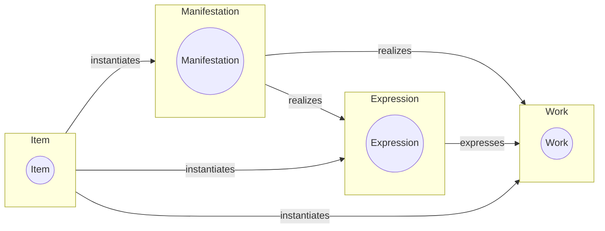

# openwemi

*Main document: [docs/index.md](docs/index.md)*

The concepts first introduced in the FRBR document and known as “WEMI” (Work, Expression, Manifestation, Item) have been employed in situations quite different from the library bibliographic catalog. (More in this [article](https://journal.code4lib.org/articles/16491) and see the [bibliography](docs/bibliography.md)). This is evidence that a definition of similar classes that are more general than those developed for library usage would benefit metadata developers broadly. This DCMI work product proposes a minimally constrained set of classes and relationships that could form the basis for a useful model of created works that defines WEMI as RDF classes with few constraints. These classes can be used together or separately in metadata to characterize aspects of creations. 

openWEMI classes are purposely defined very broadly. Experience shows that metadata models are likely to use openWEMI classes as superclasses to the more specific materials being described. 

## The proposal

This is work to create a non-constrained version of FRBR's Work, Expression, Manifestation, Item. In particular it removes any disjoint rules between the WEMI entities. It is based on the [FRBR Core](http://purl.org/vocab/frbr/core) created by Ian Davis and Richard Newman, with contributions by Bruce D'Arcus. 

The minimal WEMI set has these classes and subclasses:

* Endeavor
  * Work
  * Expression
  * Manifestation
  * Item
* ResponsibleEntity

It has these properties which define the primary relationships between WEMI:

* expresses (range: Work)
* manifests (range: Work or Expression)
* instantiates (range: Work or Expression or Manifestation)

Which is expressed in this diagram:

It also includes a same-entity relationship property for each entity:

* Work/Work
* Expression/Expression
* Manifestation/Manifestation
* Item/Item

This proposal does not include the FRBR Group2 or Group3 entities (responsible bodies and subjects). It does include the superclass Endeavor, which is not part of the FRBR group of entities but was added by the authors of FRBR core. 

## Examples

See the [Examples](examples) directory for examples of possible uses of openWEMI.

## Files

* openWEMI.ttl (May, 2023) - this defines the WEMI classes as being sub-classes of "/Endeavor/". Endeavor encompasses the entire creation. Endeavor was introduced in [frbrCore](https://vocab.org/frbr/core). It also includes property "relatedEndeavor" from that vocabulary which is a general relationship between endeavors and "ResponsibleEntity", a general class to define the agent responsible for the creation.  

## Documents

* [openWEMI](docs/index.md)
* [Bibliography](docs/bibliography.md)
* [FAQ](FAQ.md)

## The Community Group

This [DCMI Community Group](https://www.dublincore.org/groups/openwemi/) has the following goals:

*   an analysis of existing uses of WEMI which could benefit from an unconstrained vocabulary for those classes
*   a gathering of issues and questions regarding the possibilities for such a vocabulary
*   production of an unconstrained WEMI vocabulary with a specific proposal for the DCMI usage board
*   a repository of documentation and examples
 
Most work will take place here on github.

**Join the group mailing list** for updates and announcements

<https://lists.dublincore.org/mailman/listinfo/openwemi>
