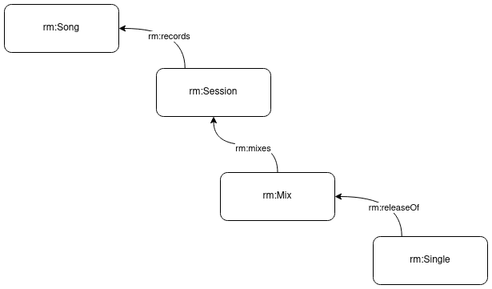
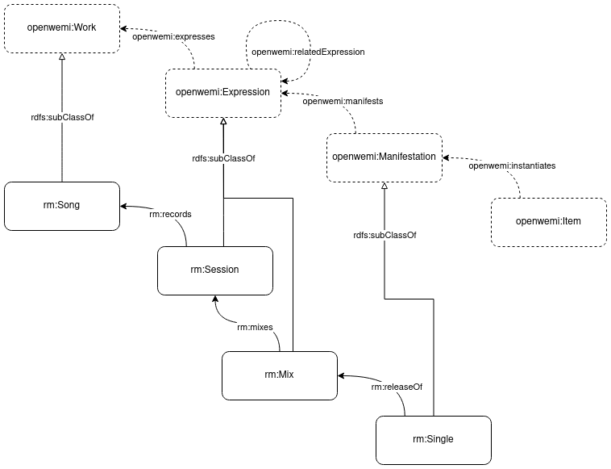
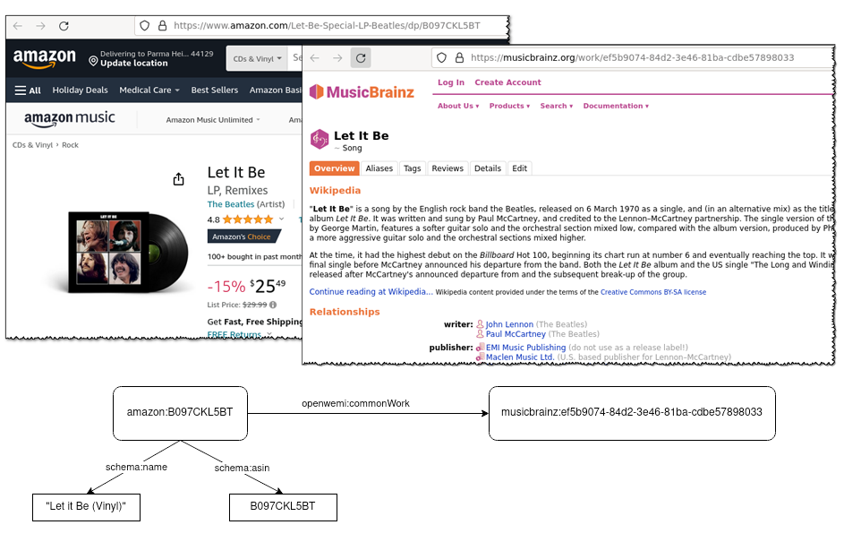

# OpenWEMI Primer
**A minimally constrained vocabulary for Work, Expression, Manifestation, and Item**

## About this specification
This document and the related resources are the work of the Dublin Core Metadata Initiative's OpenWEMI Community Group. The group uses github for its work, and welcomes comments on the work. All resources are open for viewing and github issues can be created by anyone with a github account. The email list is self-subscribe. 

* The [OpenWEMI mailing list](https://lists.dublincore.org/mailman/listinfo/openwemi)
* [OpenWEMI on github](https://github.com/dcmi/openwemi)

## Introduction

OpenWEMI is an RDF vocabulary based on the concepts of Work, Expression, Manifestation, and Item (WEMI) that were first introduced in the [Functional Requirements for Bibliographic Records (FRBR)](http://archive.ifla.org/VII/s13/frbr/frbr_2008.pdf) document that was produced by a working group of the International Federation of Library Associations (IFLA). 

For the purposes of this draft, the vocabulary is using the namespace https://dcmi.github.io/openwemi/ns#. It is anticipated that a true namespace will be assigned after review by the DCMI Usage Board.

* Human-friendly documentation: [https://dcmi.github.io/openwemi/ns/openWEMI.html](https://dcmi.github.io/openwemi/ns/openWEMI.html)
* Vocabulary in turtle: [https://dcmi.github.io/openwemi/ns/openWEMI.ttl](https://dcmi.github.io/openwemi/ns/openWEMI.ttl)

[The OpenWEMI Cookbook](https://github.com/dcmi/openwemi/wiki) has use cases and examples of uses of OpenWEMI.

## Background

The original analysis by the FRBR Working Group produced a 4-entity model of metadata that could be applied to every library catalog entry. *Work* is the most abstract layer that represents the conceptual aspect of a creation. *Expression* is a creation using some form of communication like text, sound, or a visual display. *Manifestation* is the realization, which can be a manufactured product in multiple copies or a single object. *Item* is an individual instance of the creation, often having a location in the world, including electronic locations.

The concepts introduced in the FRBR document have been employed in metadata for resources quite different from those in the library bibliographic catalog, and often ignoring some of the restrictions built in to the original definition. (More in this [article](https://journal.code4lib.org/articles/16491) and see the [bibliography](bibliography.md)). This is evidence that a definition of similar classes that are more general than those developed for library usage would benefit metadata developers broadly. OpenWEMI retains the basic concepts defined in FRBR, but expanded beyond the bibliographic application.

## OpenWEMI

OpenWEMI defines a minimally constrained version of FRBR's Work, Expression, Manifestation, Item. It removes any disjoint rules between the WEMI entities and removes any reference to bibliographic entities from their definitions. It also allows relationships between the classes that are not present in library FRBR. OpenWEMI is loosely based on the [FRBR Core](http://purl.org/vocab/frbr/core) created by Ian Davis and Richard Newman, with contributions by Bruce D'Arcus, and which is used in several non-library RDF implementations. The OpenWEMI vocabulary includes the superclass Endeavor, which is not part of the FRBR group of entities but was added by the authors of FRBR core and serves to create a coherent grouping of the entities. An *Endeavor* is a creation that may be described by any of the WEMI classes, as appropriate to the nature of the creation and the use cases addressed by the metadata. It also can be useful should any new high-order entities be added in the future. 

OpenWEMI classes are purposely defined very broadly and the property relationships are flexible while retaining the basic semantics of general (Work) to specific (Item). Experience shows that metadata models are likely to use OpenWEMI classes as superclasses to the more specific resources being described, such as *MusicWork* or *FashionDesign*. The OpenWEMI classes can be used together or separately in metadata to characterize aspects of creations.  
 
### Classes
The minimal WEMI set has these classes and subclasses:
* Endeavor
  * Work
  * Expression
  * Manifestation
  * Item
 
  

These are defined in the vocabulary as:
* Endeavor: "A creation"
* Work: "An abstract notion of an artistic or intellectual creation."
* Expression: "A perceivable form of the creation"
* Manifestation: "The physical embodiment of a creation"
* Item: "An exemplar of a creation."

### Relationship properties
These properties define the primary relationships between WEMI:
  * expresses (range: Work)
  * expressedBy (range: Expression)
  * manifests (range: Work or Expression)
  * manifestedBy (range Manifestation)
  * instantiates (range: Work or Expression or Manifestation)
  * instantiatedBy (range: Item)
Which is expressed in this diagram:

The primary relationship properties are as open as possible while still maintaining the logical progression between the most general concept of the Work to the Item. Unlike these relationships in FRBR and in the Library Reference Model which are strictly linear, from Work to Expression to Manifestation to Item, OpenWEMI allows all relationships that maintain the overall semantics of the classes.

The model also provides properties expressing relationships between entities of the same type
* relatedWork (range: Work)
* relatedExpression (range: Expression)
* relatedManifestation (range: Manifestation)
* relatedItem (range: Item)

What counts as "related" depends entirely on the area of the metadata description and the needs of the constituents. For example, famous works of art are often copied in different and even quite varied forms, like this:
<!--  -->
  

Depending on ones' need, these could be considered related works. Some artworks are created in multiple copies that are considered distinct. These might be viewed as related manifestations, or even as related copies.

In the fashion industry, designs are re-purposed by different brands, creating what could be seen as related works.
  

In addition to these relationships there are properties that can be used to indicate that two resources represent or belong to the same openwemi class:
* commonEndeavor
* commonWork
* commonExpression
* commonManifestation
* commonItem
  
There are no ranges or domains for these properties so they could be used without making a class inference about either resource. They can be used to describe relationships between resources or resource representations that do not otherwise make use of the WEMI concepts.

## Modeling decisions
It is possible to use OpenWEMI in two ways. The first is to refine OpenWEMI by creating subclasses and subproperties for specific uses. The second is to use classes and properties from OpenWEMI in instance data alongside those from any other vocabulary.

### Refining OpenWEMI for specific uses
The OpenWEMI elements are defined very broadly with the intention of encouraging reuse in a wide variety of circumstances, by defining sub-classes and sub-properties in the metadata vocabulary that are specific to the resources being described. It is not required that there be a one-to-one relationship with OpenWEMI terms. OpenWEMI is a starting point on which one can define additional concepts for the metadata in question. 

For example, metadata describing recorded music might define subclasses such as:

This is a very simplified example showing that a song may be recorded in a session; that recorded session may be used in a mix and a single may be released based on that mix. For example, here are some properties that might be associated with these classes:

* for Song: title, composer, lyrics.
* for Expression: band, session engineer, output format (e.g. analog or digital), date and time.
* for Mix: mixing engineer, output format (e.g. analog or digital), data and time.
* for Single: publisher, cover art, date.

The additional properties are out of scope for OpenWEMI, but hopefully the give some indication of why these specific entities might be important within the recording industry.

In order to use OpenWEMI one would relate the recorded music classes and the properties that link them to those from OpenWEMI as sub-classes and sub-properties. There may be more than one view on what are the best relationships; for example is a Mix a new Work based on one or more session recordings, or is it another Expression of the same work: in the diagram below we illustrate the latter option.

Taking into account the class relationships we can create relationships between the recorded music properties and the properties defined in OpenWEMI:

| Recorded Music | relationship | OpenWEMI |
|--------------|-----------------------|-----------|
| rm:records | rdfs:subPropertyOf | openwemi:expresses |
| rm:mixes | rdfs:subPropertyOf | openwemi:relatedExpression |
| rm:releaseOf | rdfs:subPropertyOf | openwemi:instantiates |

### Direct use of OpenWEMI in RDF data

Elements of the OpenWEMI vocabulary can be implemented into or used alongside other metadata vocabularies, such as [Schema.org](https://schema.org), and incorporated directly into existing metadata. The snippets below present two approaches for aligning `openwemi:Work` with `schema:CreativeWork` and `openwemi:Item` with `schema:IndividualProduct` in simple JSON-LD examples for *Let It Be*.

  
Example 1: Let it Be (openwemi:Work/schema:CreativeWork)

  
  <pre>{
  "@context": {
    "openwemi": "https://dcmi.github.io/openwemi/ns#",
    "schema": "https://schema.org/"
  },
  "@type": [
    "openwemi:Work",
    "schema:CreativeWork"
  ],
  "schema:name": "Let It Be"
}</pre>

  
Example 2: Let it Be (openwemi:Item/schema:IndividualProduct)

  
  <pre>{
  "@context": {
    "openwemi": "https://dcmi.github.io/openwemi/ns#",
    "schema": "https://schema.org/"
  },
  "@type": [
    "openwemi:Item",
    "schema:IndividualProduct"
  ],
  "schema:name": "Let It Be",
  "schema:asin": "B097CKL5BT"
}</pre>

 

 
OpenWEMI "common" properties can be used to state that any two metadata instance have one of the WEMI concepts in common, regardless of their metadata formats. In practice this requires that the metadata instances have identifiers that can be used in the statement. For example, the snippet below demonstrates use of the `openwemi:commonWork` property to link a specific recording and product offering of *Let it Be* ([ASIN B097CKL5BT](https://www.amazon.com/Let-Be-Special-LP-Beatles/dp/B097CKL5BT)) to its common work in [MusicBrainz](https://musicbrainz.org/work/ef5b9074-84d2-3e46-81ba-cdbe57898033).

 

  
Example 3: Let it Be (openwemi:commonWork)

  
  <pre>{
  "@context": {
    "openwemi": "https://dcmi.github.io/openwemi/ns#",
    "schema": "https://schema.org/"
  },
  "@type": [
    "openwemi:Item",
    "schema:IndividualProduct"
  ],
  "schema:name": "Let It Be",
  "schema:asin": "B097CKL5BT",
   "openwemi:commonWork": "https://musicbrainz.org/work/ef5b9074-84d2-3e46-81ba-cdbe57898033"
}</pre>

 
Additional RDF examples can be found in the [OpenWEMI Cookbook](https://github.com/dcmi/openwemi/wiki). 

## References

* IFLA Study Group on the Functional Requirements for Bibliographic Records. (2009) Functional Requirements for Bibliographic Records. Den Haag. [http://archive.ifla.org/VII/s13/frbr/frbr_2008.pdf](http://archive.ifla.org/VII/s13/frbr/frbr_2008.pdf)
* Coyle, Karen. (2022) Works, Expressions, Manifestations, Items: An Ontology. Code4lib Journal, Issue 53, 2022-05-09. [https://journal.code4lib.org/articles/16491](https://journal.code4lib.org/articles/16491)
* Davis, Ian and Richard Newman. (2005) FRBR Core [http://purl.org/vocab/frbr/core](http://purl.org/vocab/frbr/core)
