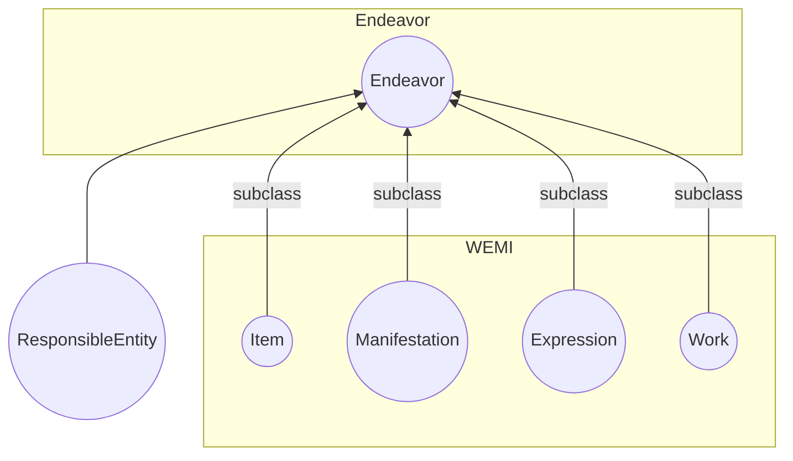
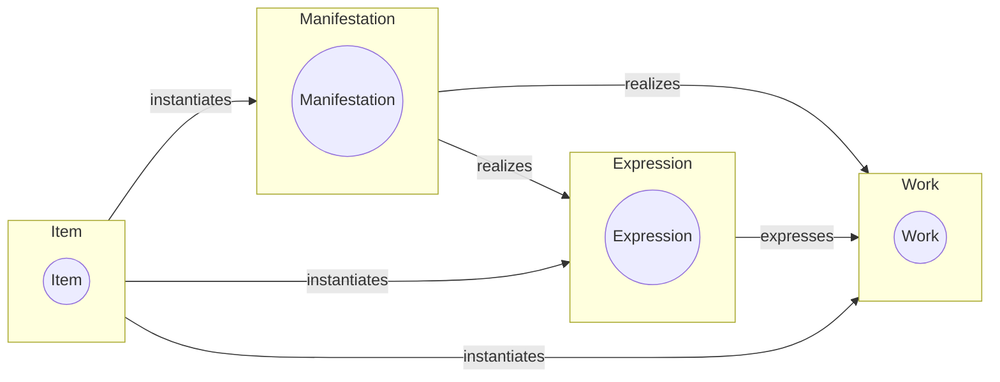
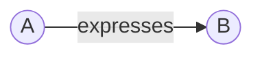
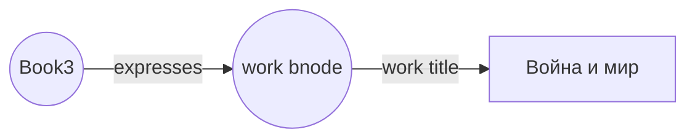
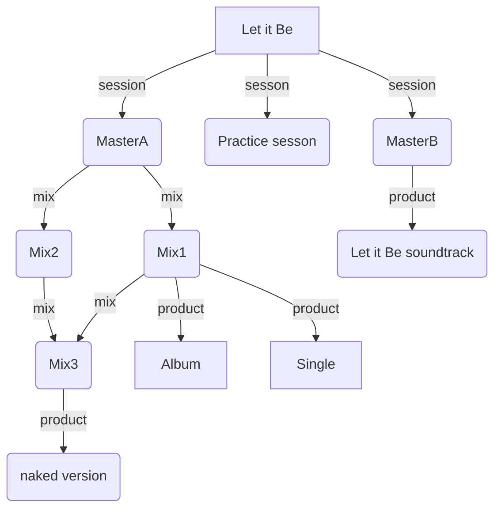

# openwemi

The concepts first introduced in the FRBR document and known as “WEMI” (Work, Expression, Manifestation, Item) have been employed in situations quite different from the library bibliographic catalog. (More in this [article](https://journal.code4lib.org/articles/16491) and see the [bibliography](bibliography.md)). This is evidence that a definition of similar classes that are more general than those developed for library usage would benefit metadata developers broadly. This DCMI work product proposes a minimally constrained set of classes and relationships that could form the basis for a useful model of created works that defines WEMI as RDF classes with few constraints. These classes can be used together or separately in metadata to characterize aspects of creations. 

openWEMI classes are purposely defined very broadly. Experience shows that metadata models are likely to use openWEMI classes as superclasses to the more specific materials being described. The proposal includes the superclass Endeavor, which is not part of the FRBR group of entities but was added by the authors of FRBR core and is deemed to be needed to create a coherent grouping of the entities. It also would be useful should any new high-order entities be added in the future. 

## WEMI
An analysis of existing library catalog data revealed a multi-level structure within the catalog entries. This structure was inherent in the data but did not inform the structure of the catalog itself. Within the analysis was the development of a 4-layer model of metadata that could be applied to every catalog entry:
1. Work, the most abstract layer that represented the conceptual aspect of a creation
2. Expression, the perceptible version using some form of communication like text, musical notation, film, or sound recording
3. Manifestation, the physical realization, which can be a manufactured product in multiple copies or a single realization
4. Item, an individual instance of the creation, often having a location in the world, including electronic locations

This proposal includes one other class which is a super-class over the WEMI classes: Endeavor. 
5. Endeavor is a creation that may be described by any of the WEMI classes, as appropriate to the nature of the creation and the use cases addressed by the metadata

## The proposal

This is work to create a non-constrained version of FRBR's Work, Expression, Manifestation, Item. In particular it removes any disjoint rules between the WEMI entities and removes any reference to bibliographic entities from their definitions. It is loosely based on the [FRBR Core](http://purl.org/vocab/frbr/core) created by Ian Davis and Richard Newman, with contributions by Bruce D'Arcus. 
### Classes
The minimal WEMI set has these classes and subclasses:
* Endeavor
  * Work
  * Expression
  * Manifestation
  * Item
* ResponsibleEntity

These are defined as:
* Endeavor: "A creation"
* Work: "An abstract notion of an artistic or intellectual creation."
* Expression: "A perceivable form of the creation"
* Manifestation: "The physical embodiment of a creation"
* Item: "An exemplar of a creation."
* ResponsibleEntity: "An agent with some responsibility related to a creation."

### Relationship properties
These properties define the primary relationships between WEMI:
  * expresses (range: Work)
  * manifests (range: Work or Expression)
  * instantiates (range: Work or Expression or Manifestation)
    
Which is expressed in this diagram:

The relationship properties are as open as possible while still maintaining the logical progression between the most general concept of the work to the item. Unlike these relationships in FRBR and in the Library Reference Model which are strictly linear, from work to expression to manifestation to item, openWEMI allows all relationships that maintain the overall semantics of the classes.

### Same entity relationships

The model assumes that properties expressing relationships between entities of the same type: Work/Work, Expression/Expression, Manifestation/Manifestation, and Item/Item will exist6. For example, a text and the translation of the text could have an Expression/Expression relationship. A reprint of printed document could be a Manifestation of a Manifestation. 

These properties are:

* relatedEndeavor
* relatedWork
* relatedExpression
* relatedManifestation
* relatedItem
  
The type of relationship is purposely not defined in openWEMI with the intention that implementing vocabularies will define more specific relationships as needed. For example, in a vocabulary that describes both books and movies, a vocabulary term that relates a book Work and a movie Work could subclass a term meaning "based on" to `relatedWork` that would be used to related movies that are based on books.

### Domains and ranges
RDF vocabularies have semantic qualities called **domains** and **ranges**. Domains and ranges are RDF classes. An RDF domain asserts that the subject of the property is a member of that class. An RDF range, when it is defined as a class, means that the object is a member of that class. Classes are expressed always as IRIs, that is identifiers that begin with "http://". 

openWEMI properties have the following domains and ranges:

|property|domain|range|
|----|----|----|
|expresses|Expression|Work|
|manifests|Manifestatation|Expression or Work|
|instantiates|Item|Manifestation or Expression or Work

A statement like:

infers that A is a member of the class Expression, and B is a member of the class Work.  

Because classes in RDF are IRIs, the object of an openWEMI property must be an identifier, not a string. Where the only data available for a statement is a string, a blank node is used as the object of the statement, which in turn has an arc to the string:

As the vocabulary is defined today, this requires the use of a blank node:

A statement that uses a string as the object of an openWEMI triple is formally incorrect. Although RDF itself does not provide validation of data, if a statement does not adhere to the vocabulary's definition the downstream results are unpredictable. 

## Using openWEMI in RDF
### Vocabulary method
It is not expected that most uses of openWEMI will use the classes and properties directly although that is not in any way prohibited. The openWEMI elements are defined very broadly with the intention of encouraging reuse in a wide variety of circumstances by defining sub-elements in the metadata vocabulary that are specific to the resources being described. Metadata describing recorded music might define subclasses such as:

| openWEMI | recorded music  |
|-|-|
| openWEMI:Work | rm:Work  |
| openWEMI:Expression | rm:Session  |
| openWEMI:Manifestation | rm:Product  |

It is not required that sub-elements be one-to-one with openWEMI. openWEMI is a starting point on which one can define additional concepts for the metadata in question. As an example, recorded music may have specific expressions that are derived from other expressions, and therefore could define

| openWEMI | recorded music  |
|-|-|
| openWEMI:Work | rm:Work  |
| openWEMI:Expression | rm:Session  |
| openWEMI:Expression | rm: Mix |
| openWEMI:Manifestation | rm:Product  |

Properties can also be sub-defined to the openWEMI properties, and may be renamed to be specific to the resources being described. 

| openWEMI | recorded music  |
|-|-|
| openWEMI:expresses | rm:records  |
| openWEMI:expresses | rm:mixes |

This could look like:

Alternately, because there is no prohibition against adding new classes or properties to the basic model, one could create other classes and properties that do not have an equivalent in openWEMI.

| openWEMI | recorded music  |
|-|-|
| openWEMI:Work | rm:Work  |
| openWEMI:Expression | rm:Session  |
|  | rm: Mix |
| openWEMI:Manifestation | rm:Product  |
| openWEMI | recorded music  |
| openWEMI:expresses | rm:records  |
|  | rm:mixes |

Whether one subdefines all elements to an openWEMI element or adds elements beyond those of the openWEMI model depends on the use cases one is addressing. If it is desirable to search on the broad openWEMI elements then defining elements with subordinate relationships to openWEMI in the vocabulary is useful.

For those with existing vocabularies who for their own reasons do not want to make direct connections between the vocabulary and openWEMI, openWEMI elements can be used directly in metadata.
--example here--

