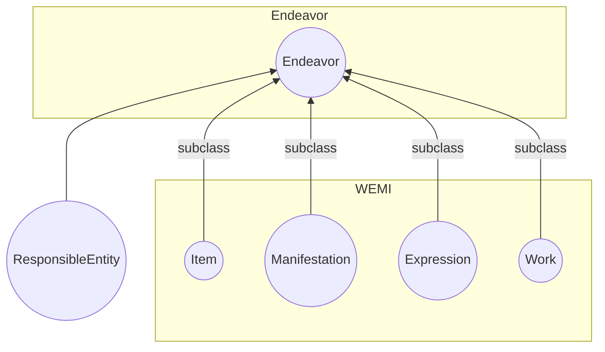
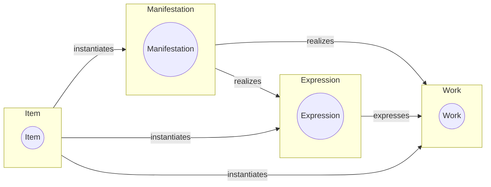

# openwemi

The concepts first introduced in the FRBR document and known as “WEMI” (Work, Expression, Manifestation, Item) have been employed in situations quite different from the library bibliographic catalog. (More in this [article](https://journal.code4lib.org/articles/16491) and see the [bibliography](bibliography.md)). This is evidence that a definition of similar classes that are more general than those developed for library usage would benefit metadata developers broadly. This DCMI work product proposes a minimally constrained set of classes and relationships that could form the basis for a useful model of created works that defines WEMI as RDF classes with few constraints. These classes can be used together or separately in metadata to characterize aspects of creations. 

openWEMI classes are purposely defined very broadly. Experience shows that metadata models are likely to use openWEMI classes as superclasses to the more specific materials being described. The proposal includes the superclass Endeavor, which is not part of the FRBR group of entities but was added by the authors of FRBR core and is deemed to be needed to create a coherent grouping of the entities. It also would be useful should any new high-order entities be added in the future. 

## WEMI
An analysis of existing library catalog data revealed a multi-level structure within the catalog entries. This structure was inherent in the data but did not inform the structure of the catalog itself. Within the analysis was the development of a 4-layer model of metadata that could be applied to every catalog entry:
1. Work, the most abstract layer that represented the conceptual aspect of a creation
2. Expression, the perceptible version using some form of communication like text, musical notation, film, or sound recording
3. Manifestation, the physical realization, which can be a manufactured product in multiple copies or a single realization
4. Item, an individual instance of the creation, often having a location in the world, including electronic locations

This proposal includes one other class which is a super-class over the WEMI classes: Endeavor. 
5. Endeavor is a creation that may be described by any of the WEMI classes, as appropriate to the nature of the creation and the use cases addressed by the metadata

## The proposal

This is work to create a non-constrained version of FRBR's Work, Expression, Manifestation, Item. In particular it removes any disjoint rules between the WEMI entities and removes any reference to bibliographic entities from their definitions. It is loosely based on the [FRBR Core](http://purl.org/vocab/frbr/core) created by Ian Davis and Richard Newman, with contributions by Bruce D'Arcus. 
### Classes
The minimal WEMI set has these classes and subclasses:
* Endeavor
  * Work
  * Expression
  * Manifestation
  * Item
* ResponsibleEntity

These are defined as:
* Endeavor: "A creation"
* Work: "An abstract notion of an artistic or intellectual creation."
* Expression: "A perceivable form of the creation"
* Manifestation: "The physical embodiment of a creation"
* Item: "An exemplar of a creation."
* ResponsibleEntity: "An agent with some responsibility related to a creation."

### Relationship properties
These properties define the primary relationships between WEMI:
  * expresses (range: Work)
  * manifests (range: Work or Expression)
  * instantiates (range: Work or Expression or Manifestation)
Which is expressed in this diagram:

The relationship properties are as open as possible while still maintaining the logical progression between the most general concept of the work to the item. Unlike these relationships in FRBR and in the Library Reference Model which are strictly linear, from work to expression to manifestation to item, openWEMI allows all relationships that maintain the overall semantics of the classes.

The model assumes that properties expressing relationships between entities of the same type: Work/Work, Expression/Expression, Manifestation/Manifestation, and Item/Item will exist6. For example, a text and the translation of the text could have an Expression/Expression relationship. A reprint of printed document could be a Manifestation of a Manifestation. 

## Using and Extending openWEMI

